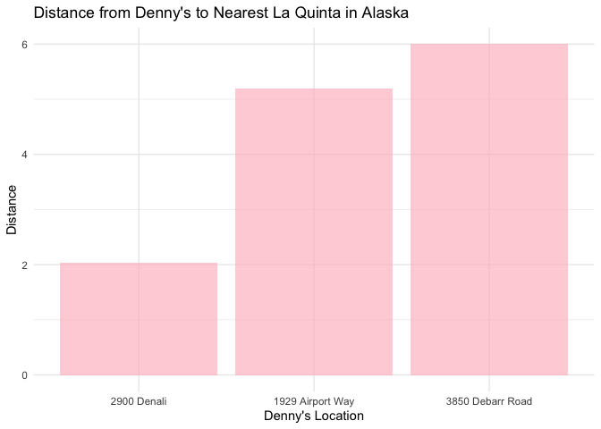

Lab 05 - La Quinta is Spanish for next to Denny’s, Pt. 2
================
Yuxin Xie
2/13/2025

### install.packages(“devtools”)

\###devtools::install_github(“rstudio-education/dsbox”)

### Load packages and data

``` r
library(tidyverse) 
library(dsbox) 
```

``` r
states <- read_csv("data/states.csv")
dn <- dsbox::dennys
lq <- dsbox::laquinta
```

### Exercise 1

``` r
dn_ak <- dn %>%
  filter(state == "AK")
nrow(dn_ak)
```

    ## [1] 3

``` r
## There are 3 Denny’s locations in Alaska.

lq_ak <- lq %>%
  filter(state == "AK")
nrow(lq_ak)
```

    ## [1] 2

``` r
## There are 2 La Quinta locations in Alaska.
```

### Exercise 2

``` r
## There are 6 pairings we need to calculate 
```

### Exercise 3

``` r
#?full_join
dn_lq_ak <- full_join(dn_ak, lq_ak, 
                      by = "state")
```

    ## Warning in full_join(dn_ak, lq_ak, by = "state"): Detected an unexpected many-to-many relationship between `x` and `y`.
    ## ℹ Row 1 of `x` matches multiple rows in `y`.
    ## ℹ Row 1 of `y` matches multiple rows in `x`.
    ## ℹ If a many-to-many relationship is expected, set `relationship =
    ##   "many-to-many"` to silence this warning.

``` r
dn_lq_ak
```

    ## # A tibble: 6 × 11
    ##   address.x     city.x state zip.x longitude.x latitude.x address.y city.y zip.y
    ##   <chr>         <chr>  <chr> <chr>       <dbl>      <dbl> <chr>     <chr>  <chr>
    ## 1 2900 Denali   Ancho… AK    99503       -150.       61.2 3501 Min… "\nAn… 99503
    ## 2 2900 Denali   Ancho… AK    99503       -150.       61.2 4920 Dal… "\nFa… 99709
    ## 3 3850 Debarr … Ancho… AK    99508       -150.       61.2 3501 Min… "\nAn… 99503
    ## 4 3850 Debarr … Ancho… AK    99508       -150.       61.2 4920 Dal… "\nFa… 99709
    ## 5 1929 Airport… Fairb… AK    99701       -148.       64.8 3501 Min… "\nAn… 99503
    ## 6 1929 Airport… Fairb… AK    99701       -148.       64.8 4920 Dal… "\nFa… 99709
    ## # ℹ 2 more variables: longitude.y <dbl>, latitude.y <dbl>

### Exercise 4

``` r
## there are 6 observations in the joined dn_lq_ak data frame. There are 11 variabels. 
```

### Exercise 5

``` r
##One way of calculating the distance between any two points on the earth is to use the Haversine distance formula. This formula takes into account the fact that the earth is not flat, but instead spherical.
## This function is not available in R, but we can save the following function to a file called haversine.R that we can load and then use:

haversine <- function(long1, lat1, long2, lat2, round = 3) {
  # convert to radians
  long1 <- long1 * pi / 180
  lat1 <- lat1 * pi / 180
  long2 <- long2 * pi / 180
  lat2 <- lat2 * pi / 180

  R <- 6371 # Earth mean radius in km

  a <- sin((lat2 - lat1) / 2)^2 + cos(lat1) * cos(lat2) * sin((long2 - long1) / 2)^2
  d <- R * 2 * asin(sqrt(a))

  return(round(d, round)) # distance in km
}
```

### Exercise 6

``` r
dn_lq_ak <- dn_lq_ak %>%
  mutate (distance = haversine (longitude.x, latitude.x, longitude.y,  latitude.y, round =3))

print (dn_lq_ak$distance)
```

    ## [1]   2.035 416.031   5.998 413.653 419.879   5.197

### Exercise 7

``` r
dn_lq_ak_mindist <- dn_lq_ak %>%
  group_by(address.x) %>%
  summarize(closest = min(distance))
dn_lq_ak_mindist
```

    ## # A tibble: 3 × 2
    ##   address.x        closest
    ##   <chr>              <dbl>
    ## 1 1929 Airport Way    5.20
    ## 2 2900 Denali         2.04
    ## 3 3850 Debarr Road    6.00

### Exercise 8

``` r
summary(dn_lq_ak_mindist$closest)
```

    ##    Min. 1st Qu.  Median    Mean 3rd Qu.    Max. 
    ##   2.035   3.616   5.197   4.410   5.598   5.998

``` r
ggplot(dn_lq_ak_mindist, aes(x = reorder(address.x, closest), y = closest)) +
  geom_bar(stat = "identity", fill = "pink", alpha = 0.7) +
  labs(title = "Distance from Denny's to Nearest La Quinta in Alaska",
       x = "Denny's Location",
       y = "Distance") +
  theme_minimal()
```

<!-- -->

``` r
## from each Denny's to its nearest La Quinta in Alaska is within 6 km.
## min is 2.035km, max = 5.998km, on average, the distance from Denny's to its nearest La Quinta in Alaska is 4.41km. 
```

### Exercise 9 (1)

``` r
#1 filter Denny’s and La Quinta Data Frames for NC,
dn_nc <- dn %>%
  filter(state == "NC")
nrow(dn_nc)
```

    ## [1] 28

``` r
## There are 28 Denny’s locations in NC.

lq_nc <- lq %>%
  filter(state == "NC")
nrow(lq_nc)
```

    ## [1] 12

``` r
## There are 12 La Quinta locations in NC.
```

### Exercise 9 (2)

``` r
#2 join these data frames to get a complete list of all possible pairings
dn_lq_nc <- full_join(dn_nc, lq_nc, 
                      by = "state")
```

    ## Warning in full_join(dn_nc, lq_nc, by = "state"): Detected an unexpected many-to-many relationship between `x` and `y`.
    ## ℹ Row 1 of `x` matches multiple rows in `y`.
    ## ℹ Row 1 of `y` matches multiple rows in `x`.
    ## ℹ If a many-to-many relationship is expected, set `relationship =
    ##   "many-to-many"` to silence this warning.

``` r
dn_lq_nc
```

    ## # A tibble: 336 × 11
    ##    address.x    city.x state zip.x longitude.x latitude.x address.y city.y zip.y
    ##    <chr>        <chr>  <chr> <chr>       <dbl>      <dbl> <chr>     <chr>  <chr>
    ##  1 1 Regent Pa… Ashev… NC    28806       -82.6       35.6 165 Hwy … "\nBo… 28607
    ##  2 1 Regent Pa… Ashev… NC    28806       -82.6       35.6 3127 Slo… "\nCh… 28208
    ##  3 1 Regent Pa… Ashev… NC    28806       -82.6       35.6 4900 Sou… "\nCh… 28217
    ##  4 1 Regent Pa… Ashev… NC    28806       -82.6       35.6 4414 Dur… "\nDu… 27707
    ##  5 1 Regent Pa… Ashev… NC    28806       -82.6       35.6 1910 Wes… "\nDu… 27713
    ##  6 1 Regent Pa… Ashev… NC    28806       -82.6       35.6 1201 Lan… "\nGr… 27407
    ##  7 1 Regent Pa… Ashev… NC    28806       -82.6       35.6 1607 Fai… "\nCo… 28613
    ##  8 1 Regent Pa… Ashev… NC    28806       -82.6       35.6 191 Cres… "\nCa… 27518
    ##  9 1 Regent Pa… Ashev… NC    28806       -82.6       35.6 2211 Sum… "\nRa… 27612
    ## 10 1 Regent Pa… Ashev… NC    28806       -82.6       35.6 1001 Aer… "\nMo… 27560
    ## # ℹ 326 more rows
    ## # ℹ 2 more variables: longitude.y <dbl>, latitude.y <dbl>

``` r
nrow(dn_lq_nc)
```

    ## [1] 336

``` r
## there are 336 pairings 
```

### Exercise 9 (3)

``` r
#3 calculate the distances between all possible pairings of Denny’s and La Quinta in NC
dn_lq_nc <- dn_lq_nc %>%
  mutate (distance = haversine (longitude.x, latitude.x, longitude.y,  latitude.y, round =3))

print (dn_lq_nc$distance)
```

    ##   [1] 107.801 155.423 159.913 328.301 334.918 247.847 119.934 343.474 353.681
    ##  [10] 341.213 341.191 211.469 346.410 294.975 294.743 104.555  98.257 186.766
    ##  [19] 313.027  94.400  81.444  92.832  92.827 224.211  89.380 133.105 137.945
    ##  [28] 304.463 311.055 224.200  96.062 319.605 329.805 317.340 317.317 187.986
    ##  [37] 125.093   9.685  14.681 184.894 189.361 119.918  57.396 193.059 205.270
    ##  [46] 193.954 193.969  97.164 136.675   9.165   1.779 194.688 198.559 133.607
    ##  [55]  68.712 200.748 213.488 202.630 202.655 112.673 131.865  18.966  20.557
    ##  [64] 174.732 178.996 112.128  65.087 182.299 194.636 183.435 183.452  92.019
    ##  [73] 127.336  23.497  26.552 170.843 175.400 106.266  61.513 179.444 191.506
    ##  [82] 180.093 180.105  85.216 245.694 192.769 193.197   5.064   6.296  85.314
    ##  [91] 209.025  25.902  27.309  14.601  14.502 122.522 276.096 178.275 174.937
    ## [100] 102.345  96.343 139.659 219.798  78.825  91.863  91.682  91.825 165.532
    ## [109] 390.725 321.947 320.343 147.694 139.085 230.611 349.437 126.241 118.326
    ## [118] 131.293 131.357 267.574 208.651 169.093 170.795  36.130  45.202  48.696
    ## [127] 176.893  63.241  66.296  53.634  53.539  86.120 290.208 254.984 256.084
    ## [136]  63.258  62.531 134.528 263.803  73.398  59.544  62.872  62.764 170.959
    ## [145] 120.809 139.044 142.447 321.883 327.829 244.293 114.947 334.596 345.669
    ## [154] 333.559 333.550 209.466 419.141 325.934 322.368 194.851 185.234 267.604
    ## [163] 366.469 165.402 165.440 176.548 176.673 300.756 325.276 254.274 252.813
    ## [172]  86.287  76.866 166.389 281.985  60.441  55.909  68.334  68.432 202.584
    ## [181] 141.850 122.049 126.029 102.159 110.473  19.062 114.570 125.055 131.244
    ## [190] 118.282 118.214  20.099 296.465 185.969 181.213 144.227 138.276 173.944
    ## [199] 235.132 120.422 133.006 133.493 133.637 195.114 100.658  39.650  46.213
    ## [208] 174.933 180.757 100.794  38.482 187.896 198.674 186.499 186.488  71.707
    ## [217]  55.357  87.880  94.283 246.905 253.627 166.487  39.115 262.713 272.597
    ## [226] 260.046 260.020 130.439 276.852 212.084 211.413  39.509  29.902 117.665
    ## [235] 235.478  11.890  12.749  21.251  21.382 153.972 277.501 218.071 217.761
    ## [244]  35.180  26.016 117.325 238.701  17.856   5.044  18.004  18.067 154.321
    ## [253] 314.429 240.751 239.158  79.318  69.708 156.669 269.678  51.047  49.675
    ## [262]  61.012  61.130 192.250 106.856  51.004  54.520 239.749 244.836 168.072
    ## [271]  52.169 249.696 261.527 249.887 249.893 137.933 426.512 327.482 323.407
    ## [280] 210.582 201.038 279.142 371.179 180.395 182.182 192.455 192.589 310.742
    ## [289] 100.201  88.706  92.442 272.985 278.621 197.458  70.144 284.730 296.068
    ## [298] 284.113 284.109 164.237 148.800 103.258 106.113  99.752 106.531  26.711
    ## [307] 108.778 117.048 125.912 113.189 113.154  30.847 409.343 299.892 294.906
    ## [316] 218.276 209.382 274.131 349.172 187.935 193.902 201.510 201.659 301.320
    ## [325] 338.316 274.112 273.064  95.032  86.476 178.059 298.514  74.801  65.863
    ## [334]  78.811  78.869 215.131

### Exercise 9 (4)

``` r
#4 find the minimum distance between each Denny’s and La Quinta location
dn_lq_nc_mindist <- dn_lq_nc %>%
  group_by(address.x) %>%
  summarize(closest = min(distance))
dn_lq_nc_mindist
```

    ## # A tibble: 28 × 2
    ##    address.x                 closest
    ##    <chr>                       <dbl>
    ##  1 1 Regent Park Boulevard     108. 
    ##  2 101 Wintergreen Dr          120. 
    ##  3 103 Sedgehill Dr             26.7
    ##  4 1043 Jimmie Kerr Road        36.1
    ##  5 1201 S College Road         188. 
    ##  6 1209 Burkemount Avenue       39.1
    ##  7 1493 Us Hwy 74-A Bypass      70.1
    ##  8 1524 Dabney Dr               59.5
    ##  9 1550 Four Seasons           115. 
    ## 10 1800 Princeton-Kenly Road    55.9
    ## # ℹ 18 more rows

### Exercise 9 (5)

``` r
#5 visualize and describe the distribution of these shortest distances using appropriate summary statistics.
summary(dn_lq_nc_mindist$closest)
```

    ##    Min. 1st Qu.  Median    Mean 3rd Qu.    Max. 
    ##   1.779  22.388  53.456  65.444  93.985 187.935

``` r
ggplot(dn_lq_nc_mindist, aes(x = reorder(address.x, closest), y = closest)) +
  geom_bar(stat = "identity", fill = "green", alpha = 0.7) +
  labs(title = "Distance from Denny's to Nearest La Quinta in NC",
       x = "Denny's Location",
       y = "Distance") +
  theme_minimal()
```

<!-- -->

``` r
## from each Denny's to its nearest La Quinta in NC 
## min is 1.779km, max = 187.935km, on average, the distance from Denny's to its nearest La Quinta in NC is 65.444km. 
```

### Exercise 10 (1)

``` r
#1 filter Denny’s and La Quinta Data Frames for TX,
dn_tx <- dn %>%
  filter(state == "TX")
nrow(dn_tx)
```

    ## [1] 200

``` r
## There are 200 Denny’s locations in TX.

lq_tx <- lq %>%
  filter(state == "TX")
nrow(lq_tx)
```

    ## [1] 237

``` r
## There are 237 La Quinta locations in TX.
```

### Exercise 10 (2)

``` r
#2 join these data frames to get a complete list of all possible pairings
dn_lq_tx <- full_join(dn_tx, lq_tx, 
                      by = "state")
```

    ## Warning in full_join(dn_tx, lq_tx, by = "state"): Detected an unexpected many-to-many relationship between `x` and `y`.
    ## ℹ Row 1 of `x` matches multiple rows in `y`.
    ## ℹ Row 1 of `y` matches multiple rows in `x`.
    ## ℹ If a many-to-many relationship is expected, set `relationship =
    ##   "many-to-many"` to silence this warning.

``` r
dn_lq_tx
```

    ## # A tibble: 47,400 × 11
    ##    address.x    city.x state zip.x longitude.x latitude.x address.y city.y zip.y
    ##    <chr>        <chr>  <chr> <chr>       <dbl>      <dbl> <chr>     <chr>  <chr>
    ##  1 120 East I-… Abile… TX    79601       -99.6       32.4 3018 Cat… "\nAb… 79606
    ##  2 120 East I-… Abile… TX    79601       -99.6       32.4 3501 Wes… "\nAb… 79601
    ##  3 120 East I-… Abile… TX    79601       -99.6       32.4 14925 La… "\nAd… 75254
    ##  4 120 East I-… Abile… TX    79601       -99.6       32.4 909 East… "\nAl… 78516
    ##  5 120 East I-… Abile… TX    79601       -99.6       32.4 2400 Eas… "\nAl… 78332
    ##  6 120 East I-… Abile… TX    79601       -99.6       32.4 1220 Nor… "\nAl… 75013
    ##  7 120 East I-… Abile… TX    79601       -99.6       32.4 1165 Hwy… "\nAl… 76009
    ##  8 120 East I-… Abile… TX    79601       -99.6       32.4 880 Sout… "\nAl… 77511
    ##  9 120 East I-… Abile… TX    79601       -99.6       32.4 1708 Int… "\nAm… 79103
    ## 10 120 East I-… Abile… TX    79601       -99.6       32.4 9305 Eas… "\nAm… 79118
    ## # ℹ 47,390 more rows
    ## # ℹ 2 more variables: longitude.y <dbl>, latitude.y <dbl>

``` r
nrow(dn_lq_tx)
```

    ## [1] 47400

``` r
## there are 47400 pairings 
```

### Exercise 10 (3)

``` r
#3 calculate the distances between all possible pairings of Denny’s and La Quinta in TX
dn_lq_tx <- dn_lq_tx %>%
  mutate (distance = haversine (longitude.x, latitude.x, longitude.y,  latitude.y, round =3))
```

### Exercise 10 (4)

``` r
#4 find the minimum distance between each Denny’s and La Quinta location
dn_lq_tx_mindist <- dn_lq_tx %>%
  group_by(address.x) %>%
  summarize(closest = min(distance))
```

### Exercise 10 (5)

``` r
#5 visualize and describe the distribution of these shortest distances using appropriate summary statistics.
summary(dn_lq_tx_mindist$closest)
```

    ##    Min. 1st Qu.  Median    Mean 3rd Qu.    Max. 
    ##  0.0160  0.7305  3.3715  5.7918  6.6303 60.5820

``` r
ggplot(dn_lq_tx_mindist, aes(x = reorder(address.x, closest), y = closest)) +
  geom_bar(stat = "identity", fill = "purple", alpha = 0.7) +
  labs(title = "Distance from Denny's to Nearest La Quinta in TX",
       x = "Denny's Location",
       y = "Distance") +
  theme_minimal()
```

<!-- -->

``` r
## from each Denny's to its nearest La Quinta in TX 
## min is 0.016km, max = 60.582km, on average, the distance from Denny's to its nearest La Quinta in TX is 5.7918km. 
```

### Exercise 11 (1)

``` r
#1 filter Denny’s and La Quinta Data Frames for MN,
dn_MN <- dn %>%
  filter(state == "MN")
nrow(dn_MN)
```

    ## [1] 15

``` r
## There are 15 Denny’s locations in MN.

lq_MN <- lq %>%
  filter(state == "MN")
nrow(lq_MN)
```

    ## [1] 7

``` r
## There are 7 La Quinta locations in MN.
```

### Exercise 11 (2)

``` r
#2 join these data frames to get a complete list of all possible pairings
dn_lq_MN <- full_join(dn_MN, lq_MN, 
                      by = "state")
```

    ## Warning in full_join(dn_MN, lq_MN, by = "state"): Detected an unexpected many-to-many relationship between `x` and `y`.
    ## ℹ Row 1 of `x` matches multiple rows in `y`.
    ## ℹ Row 1 of `y` matches multiple rows in `x`.
    ## ℹ If a many-to-many relationship is expected, set `relationship =
    ##   "many-to-many"` to silence this warning.

``` r
dn_lq_MN
```

    ## # A tibble: 105 × 11
    ##    address.x    city.x state zip.x longitude.x latitude.x address.y city.y zip.y
    ##    <chr>        <chr>  <chr> <chr>       <dbl>      <dbl> <chr>     <chr>  <chr>
    ##  1 7805 150th … Apple… MN    55124       -93.2       44.7 1805 Map… "\nDu… 55811
    ##  2 7805 150th … Apple… MN    55124       -93.2       44.7 7815 Nic… "\nBl… 55420
    ##  3 7805 150th … Apple… MN    55124       -93.2       44.7 5151 Ame… "\nBl… 55437
    ##  4 7805 150th … Apple… MN    55124       -93.2       44.7 10420 Wa… "\nMi… 55305
    ##  5 7805 150th … Apple… MN    55124       -93.2       44.7 7011 Nor… "\nBr… 55428
    ##  6 7805 150th … Apple… MN    55124       -93.2       44.7 4353 Can… "\nRo… 55904
    ##  7 7805 150th … Apple… MN    55124       -93.2       44.7 700 Biel… "\nWo… 55125
    ##  8 8850 Univer… Blaine MN    55434       -93.3       45.1 1805 Map… "\nDu… 55811
    ##  9 8850 Univer… Blaine MN    55434       -93.3       45.1 7815 Nic… "\nBl… 55420
    ## 10 8850 Univer… Blaine MN    55434       -93.3       45.1 5151 Ame… "\nBl… 55437
    ## # ℹ 95 more rows
    ## # ℹ 2 more variables: longitude.y <dbl>, latitude.y <dbl>

``` r
nrow(dn_lq_MN)
```

    ## [1] 105

``` r
## there are 105 pairings 
```

### Exercise 11 (3)

``` r
#3 calculate the distances between all possible pairings of Denny’s and La Quinta in MN
dn_lq_MN <- dn_lq_MN %>%
  mutate (distance = haversine (longitude.x, latitude.x, longitude.y,  latitude.y, round =3))
```

### Exercise 11 (4)

``` r
#4 find the minimum distance between each Denny’s and La Quinta location
dn_lq_MN_mindist <- dn_lq_MN %>%
  group_by(address.x) %>%
  summarize(closest = min(distance))
dn_lq_MN_mindist
```

    ## # A tibble: 15 × 2
    ##    address.x             closest
    ##    <chr>                   <dbl>
    ##  1 1226 S Broadway          5.13
    ##  2 12950 Aldrich Ave S     10.2 
    ##  3 13450 Rogers Dr         18.0 
    ##  4 255 N Century Ave        2.58
    ##  5 2700 E Lake St          10.3 
    ##  6 286 17th Avenue Nw       7.75
    ##  7 3050 White Bear Ave     11.6 
    ##  8 3565 Northdale Blvd     14.2 
    ##  9 38681 Tanger Dr         56.6 
    ## 10 4209 W American Blvd     1.20
    ## 11 6405 James Circle N      6.85
    ## 12 7805 150th St Nw        14.9 
    ## 13 815 E 78th St            1.07
    ## 14 8850 University Drive   11.2 
    ## 15 9020 Quaday Ave Ne      26.0

### Exercise 11 (5)

``` r
#5 visualize and describe the distribution of these shortest distances using appropriate summary statistics.
summary(dn_lq_MN_mindist$closest)
```

    ##    Min. 1st Qu.  Median    Mean 3rd Qu.    Max. 
    ##   1.074   5.987  10.341  13.190  14.570  56.630

``` r
ggplot(dn_lq_MN_mindist, aes(x = reorder(address.x, closest), y = closest)) +
  geom_bar(stat = "identity", fill = "yellow", alpha = 0.7) +
  labs(title = "Distance from Denny's to Nearest La Quinta in MN",
       x = "Denny's Location",
       y = "Distance") +
  theme_minimal()
```

<!-- -->

``` r
## from each Denny's to its nearest La Quinta in MN 
## min is 1.074km, max = 56.63km, on average, the distance from Denny's to its nearest La Quinta in MN is 13.19km. 
```

### Exercise 12

``` r
#Among the states you examined, where is Mitch Hedberg’s joke most likely to hold true? Explain your reasoning.
# The joke is about the idea that that La Quinta Inns & Suites are often located very close to Denny’s restaurants
#Among the states (MN, TX, NC, and AK), both Texas (TX) and Alaska (AK) support this joke better than North Carolina (NC) and Minnesota (MN). In AK, all the distances from Denny's to its nearest La Q are within 6 km. And the lower average distance (4.41 km) makes it a stronger overall pattern. In TX, the average min distance also less than 6km. 
```
